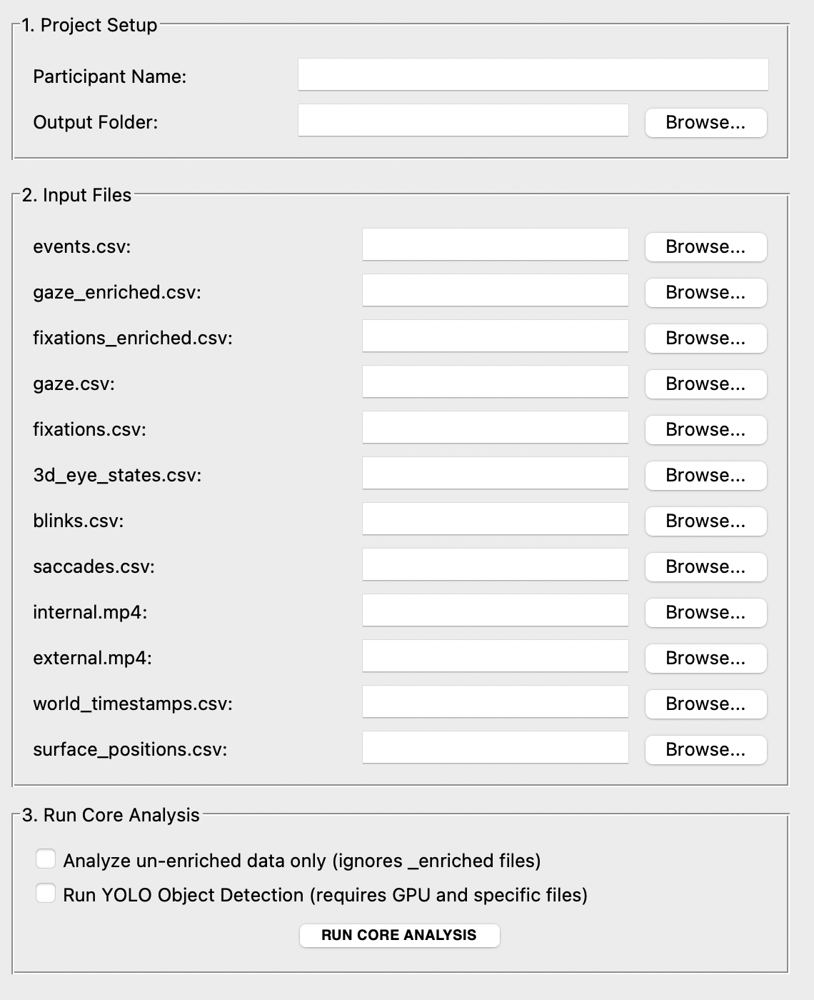
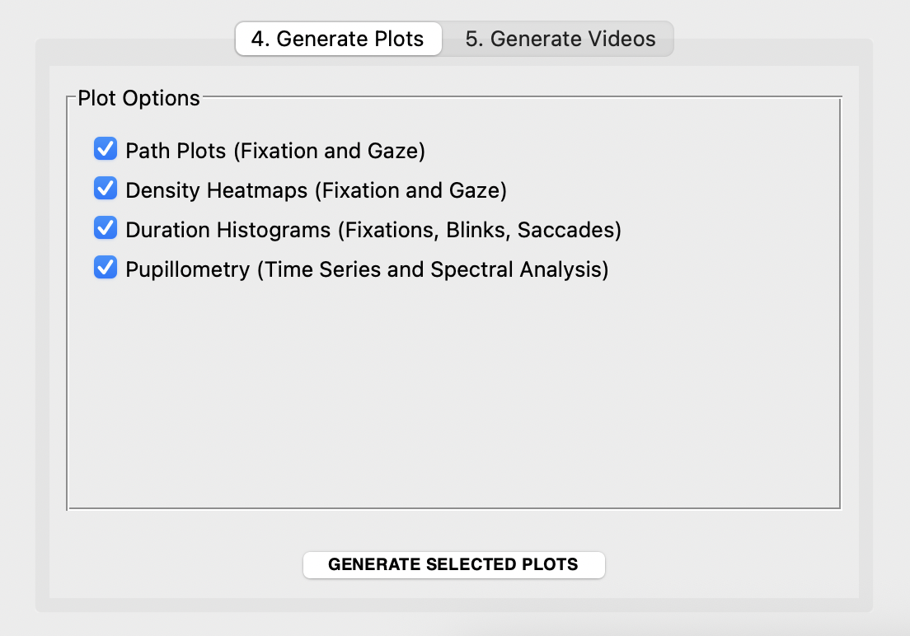
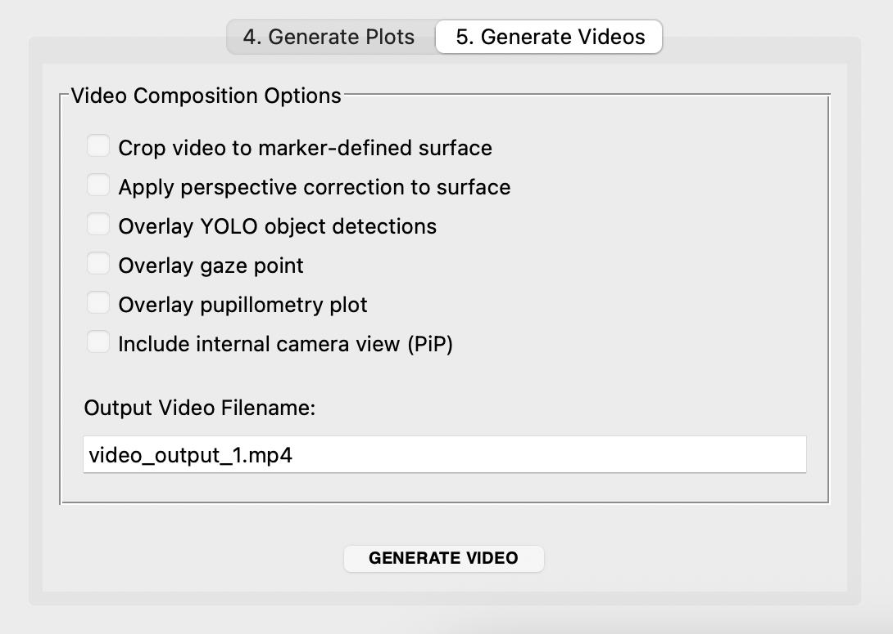

# SPEED v3.0 - labScoc Processing and Extraction of Eye tracking Data

*An Advanced Eye-Tracking Data Analysis Software*

SPEED is a Python-based tool with a graphical user interface (GUI) for processing, analyzing, and visualizing eye-tracking data from cognitive and behavioral experiments. This version introduces a powerful modular architecture that separates core data processing from output generation, allowing for unprecedented flexibility.

## The Modular Workflow

SPEED v3.0 operates on a two-step workflow designed to save time and computational resources.

**Step 1: Run Core Analysis**
This is the main data processing stage. You run this step **only once** per participant. The software will:
1. Load all the necessary input files (`.csv`, `.mp4`).
2. Segment the data based on the `events.csv` file.
3. Calculate all relevant statistics for each segment.
4. Optionally run YOLO object detection on the video frames.
5. Save the processed data (e.g., filtered dataframes for each event) and summary statistics into the output folder.

This step creates a `processed_data` directory containing intermediate files. Once this is complete, you do not need to run it again for the same participant.

**Step 2: Generate Outputs On-Demand**
After the core analysis is complete, you can use the dedicated tabs in the GUI to generate as many plots and videos as you need, with any combination of settings, without re-processing the raw data.
* **Generate Plots:** Select which categories of plots you want to create.
* **Generate Videos:** Compose highly customized videos by selecting different overlays and processing options. You can create multiple different videos from the same core analysis.

---

## Data Acquisition 📋

Before using this software, you need to acquire and prepare the data following a specific procedure with Pupil Labs tools.

* **Video Recording**: Use Pupil Labs Neon glasses to record the session.
* *(optional)* **Surface Definition (AprilTag)**: Place AprilTags at the four corners of a PC screen. These markers allow the Pupil Labs software to track the surface and map gaze coordinates onto it. For more details, see the official documentation: [**Pupil Labs Surface Tracker**](https://docs.pupil-labs.com/neon/neon-player/surface-tracker/).
* **Upload to Pupil Cloud**: Once the recording is complete, upload the data to the Pupil Cloud platform.
* *(optional)* **Enrichment with Marker Mapper**: Inside Pupil Cloud, start the "Marker Mapper" enrichment. This process analyzes the video, detects the AprilTags, generates the `surface_positions.csv` file (which contains the surface coordinates for each frame), and downloads all the data. Marker Mapper Usage Guide: [**Pupil Cloud Marker Mapper**](https://docs.pupil-labs.com/neon/pupil-cloud/enrichments/marker-mapper/#setup).

---

## Environment Setup ⚙️

To run the SPEED analysis tool, you'll need Python 3 and several scientific computing libraries. It's highly recommended to use a virtual environment to manage dependencies.

1.  **Create a virtual environment:**
    ```bash
    python -m venv speed-env
    source speed-env/bin/activate  # On Windows, use `speed-env\Scripts\activate`
    ```

2.  **Install the required libraries:**
    The required libraries depend on the analysis you want to run. Create a `requirements.txt` file with the content below. For the optional YOLO analysis, you will need `torch` and `ultralytics`.
    ```
    pandas
    numpy
    matplotlib
    opencv-python
    scipy
    tqdm
    # Optional for YOLO analysis
    torch
    ultralytics
    ```
    Then, install them using pip:
    ```bash
    pip install -r requirements.txt
    ```
    * **Note on `Tkinter`**: This is part of the Python standard library and does not require a separate installation.
    * **Note on `torch`**: Installing PyTorch can be complex, especially if you want to use a GPU (highly recommended for YOLO). Please refer to the official [PyTorch installation guide](https://pytorch.org/get-started/locally/) for instructions tailored to your system.
    * **Note on YOLO**: To use YOLO, you must download the pre-trained neural network weights from the following link: [**yolov8n.pt Download**](https://github.com/ultralytics/assets/releases/download/v0.0.0/yolov8n.pt). Place this file in the same directory as the scripts.

---

## How to Use the Application 🚀

1.  **Launch the GUI**: Run the `GUI_advanced.py` script from your terminal.
    ```bash
    python GUI_advanced.py
    ```

2.  **Sections 1-3: Setup and Core Analysis**
    * In the top sections of the GUI, fill in the **Participant Name** and select the **Output Folder**.
    * Use the "Browse..." buttons to select all the required **Input Files** for your experiment.
    * In the "Run Core Analysis" section, configure the analysis mode:
        * `Analyze un-enriched data only`: Check this box to base the entire analysis on raw pixel data.
        * `Run YOLO Object Detection`: Check this to perform object detection.
    * Click the **"RUN CORE ANALYSIS"** button and wait for the confirmation message. This completes the main data processing.

    

3.  **Section 4: Generate Plots**
    * Switch to the "Generate Plots" tab.
    * Select the categories of plots you wish to generate (e.g., Heatmaps, Path Plots).
    * Click the **"GENERATE SELECTED PLOTS"** button.

    

4.  **Section 5: Generate Videos**
    * Switch to the "Generate Videos" tab.
    * **Configure Video Composition**: Select the desired options for your video (e.g., crop to surface, overlay gaze point).
    * **Set the Output Video Filename**.
    * Click the **"GENERATE VIDEO"** button. You can repeat this step with different settings to create multiple videos from the same analysis.

    

---

## Input Files 📂

The application requires several specific files from your Pupil Labs recording.

| Standard Name          | Description                                                                    | Requirement                                      |
| ---------------------- | ------------------------------------------------------------------------------ | ------------------------------------------------ |
| `events.csv`           | Timestamps defining the start and end of experimental segments.    | **Always** |
| `gaze_enriched.csv`    | Gaze data with coordinates normalized to a detected surface.                   | Required if "un-enriched only" is **unchecked**. |
| `fixations_enriched.csv` | Fixation data with coordinates normalized to a detected surface.               | Required if "un-enriched only" is **unchecked**. |
| `gaze.csv`             | Raw gaze data with coordinates in pixels (`px`).                               | **Always** |
| `fixations.csv`        | Raw fixation data with coordinates in pixels (`px`).                           | **Always** |
| `3d_eye_states.csv`    | Pupil diameter and other 3D eye model data.                                    | **Always** |
| `blinks.csv`           | Data on blink events.                                                          | **Always** |
| `saccades.csv`         | Data on saccadic movements.                                                    | **Always** |
| `internal.mp4`         | The video recording of the participant's eye.                                  | **Always** |
| `external.mp4`         | The video recording of the participant's scene/view.                           | **Always** |
| `world_timestamps.csv` | Timestamps for each frame of the external video.                               | Required for **YOLO and Video Generation**.              |
| `surface_positions.csv`  | Corner coordinates of the marker-defined surface per frame.                    | Required for **Surface Cropping/Warping**.          |

---

## Output Files 📈

All outputs are saved within the specified `analysis_results_{participant_name}` folder.

* **`eyetracking_file/`**: Contains copies of all the input files used for the analysis.
* **`processed_data/`**: Contains intermediate data files (`.pkl`) for each event segment. This is what allows for on-demand output generation.
* **`plots/`**: Contains all the generated PDF plots.
* **`config.json`**: A file saving the settings used for the Core Analysis.
* **`summary_results_{subj_name}.csv`**: A CSV file with the main quantitative outcomes of the analysis.
* **`{video_name}.mp4`**: Each custom video you generate is saved in the main output folder with the name you provide.

### Detailed Plot Outputs

When you generate plots, the following files will be created in the `plots/` directory for each event:

* **Histograms**:
    * `hist_fix_unenriched_{event}.pdf`: Duration of un-enriched fixations.
    * `hist_fix_enriched_{event}.pdf`: Duration of enriched fixations (enriched mode only).
    * `hist_blinks_{event}.pdf`: Duration of blinks.
    * `hist_saccades_{event}.pdf`: Duration of saccades.
* **Path Plots**:
    * `path_fix_unenriched_{event}.pdf`: Sequential path of un-enriched fixations.
    * `path_gaze_unenriched_{event}.pdf`: Sequential path of un-enriched gaze points.
    * `path_fix_enriched_{event}.pdf`: Path of enriched fixations (enriched mode only).
    * `path_gaze_enriched_{event}.pdf`: Path of enriched gaze points (enriched mode only).
* **Heatmaps**:
    * `heatmap_fix_unenriched_{event}.pdf`: Density map of un-enriched fixations.
    * `heatmap_gaze_unenriched_{event}.pdf`: Density map of un-enriched gaze points.
    * `heatmap_fix_enriched_{event}.pdf`: Density map of enriched fixations (enriched mode only).
    * `heatmap_gaze_enriched_{event}.pdf`: Density map of enriched gaze points (enriched mode only).
* **Pupillometry**:
    * `pupillometry_{event}.pdf`: Time series plot of the left and right pupil diameters.
    * `periodogram_total_{event}.pdf`: Power spectral density of the entire pupil signal.
    * `spectrogram_total_{event}.pdf`: Spectrogram of the entire pupil signal.
    * `periodogram_onsurface_{event}.pdf`: Power spectral density of the pupil signal only when gaze is on the surface (enriched mode only).
    * `spectrogram_onsurface_{event}.pdf`: Spectrogram of the pupil signal only when gaze is on the surface (enriched mode only).

---
## ✍️ Authors & Citation

* This tool is developed by the **Cognitive and Behavioral Science Lab (LabSCoC), University of L'Aquila** and **Dr. Daniele Lozzi**.
* If you use this script in your research or work, please cite the following publications:

    * Lozzi, D.; Di Pompeo, I.; Marcaccio, M.; Ademaj, M.; Migliore, S.; Curcio, G. SPEED: A Graphical User Interface Software for Processing Eye Tracking Data. NeuroSci 2025, 6, 35. <https://doi.org/10.3390/neurosci6020035>
    * Lozzi, D.; Di Pompeo, I.; Marcaccio, M.; Alemanno, M.; Krüger, M.; Curcio, G.; Migliore, S. AI-Powered Analysis of Eye Tracker Data in Basketball Game. Sensors 2025, 25, 3572. <https://doi.org/10.3390/s25113572>

* If you also use the Computer Vision YOLO-based feature, please cite the following publication:

    * Redmon, J., Divvala, S., Girshick, R., & Farhadi, A. (2016). You only look once: Unified, real-time object detection. In Proceedings of the IEEE conference on computer vision and pattern recognition (pp. 779-788). <https://doi.org/10.1109/CVPR.2016.91>

## Screenshots of the GUI



