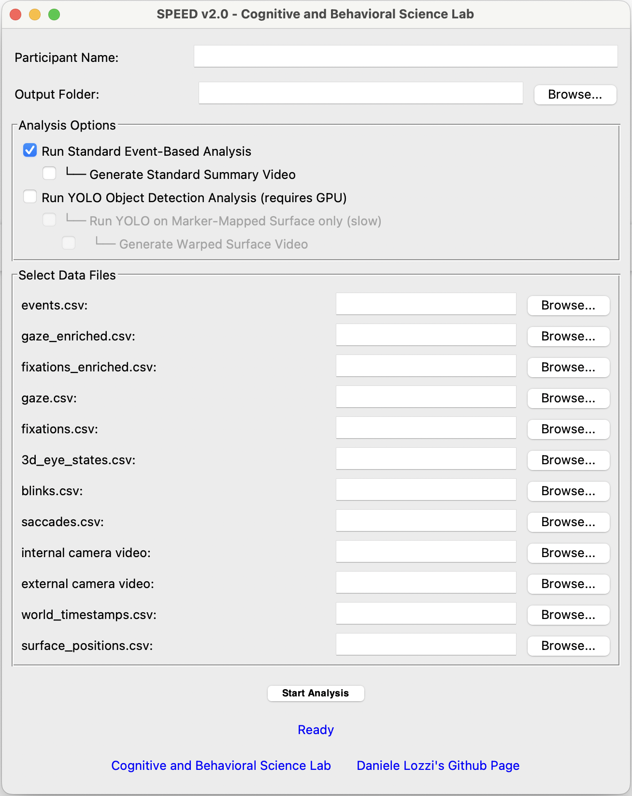

# SPEED (labScoc Processing and Extraction of Eye tracking Data)

*Eye-Tracking Data Analysis Software*

SPEED is a Python-based tool with a graphical user interface (GUI) for processing and analyzing eye-tracking data from cognitive and behavioral experiments. It is designed to segment data based on predefined events, calculate key metrics, and generate visualizations of eye movements like gaze paths and fixations.

The tool can handle both raw (un-enriched) and surface-projected (enriched) eye-tracking data, making it flexible for various stages of the analysis pipeline.

## Data acquisition 📋

Before using this software, you need to acquire and prepare the data following a specific procedure with Pupil Labs tools.
* **Video Recording**: Use Pupil Labs Neon glasses to record the session
* *optionally* **Surface Definition (AprilTag)**: Place AprilTags at the four corners of the PC screen. These markers allow the Pupil Labs software to track the surface and map the coordinates of the gaze on it. For more details, see the official documentation: [**Pupil Labs Surface Tracker**](https://docs.pupil-labs.com/neon/neon-player/surface-tracker/).
**Upload to Pupil Cloud**: Once the recording is complete, upload the data to the Pupil Cloud platform.
* *optionally* **Enrichment with Marker Mapper**: Inside Pupil Cloud, start the Marker Mapper enrichment. This process analyzes the video, detects AprilTags and generates the file `surface_positions.csv`, which contains the surface coordinates for each frame and downloads all the data. Marker Mapper Usage Guide: [**Pupil Cloud Marker Mapper**](https://docs.pupil-labs.com/neon/pupil-cloud/enrichments/marker-mapper/#setup).

## Features ✨

* **Graphical User Interface (GUI)**: An intuitive `Tkinter`-based interface for easy file selection and configuration.
* **Event-Based Segmentation**: Analyzes eye-tracking data in segments defined by timestamps in an `events.csv` file.
* **Dual Analysis Mode**: Supports both "un-enriched" (pixel-based) and "enriched" (surface-normalized) data.
* **Path Plot Generation**: Automatically creates and saves PDF plots for fixation paths and raw gaze paths for each event segment.
* **Summary Statistics**: Generates a final CSV file with aggregated metrics for each analysis segment.
* **Automated File Management**: Creates a structured output folder for each participant, copying input files and saving results neatly.
* **Enhanced Pupillometry Plotting**: Generates a detailed pupillometry time series plot with dynamic background coloring and separate lines for left and right pupil diameters.
* **Saccade Analysis Plots**: Visualizes mean and peak saccade velocities over time, as well as saccade amplitude over time.
* **Blink Time Series**: Provides a binary time series plot indicating the presence or absence of blinks.
* **Density Heatmap Generation**: Creates heatmaps that visualize the areas of highest concentration for fixations and gaze points using a kernel density estimate (KDE).
* **YOLOv8 Object Detection Integration**: Optionally detects and tracks objects in the scene video, correlating gaze data to specific objects. This allows for statistics like normalized fixation counts and average pupil diameter per object class or instance.
* **Focused Surface Analysis**: A dedicated mode to run YOLO analysis exclusively on a marker-defined surface. The tool automatically crops and applies perspective correction to each video frame before analysis, isolating the area of interest (e.g., a computer screen) for highly accurate object and gaze tracking within that specific zone.

## Environment Setup ⚙️

To run the SPEED analysis tool, you'll need Python 3 and several scientific computing libraries. It's highly recommended to use a virtual environment to manage dependencies.

1.  **Create a virtual environment:**
    ```bash
    python -m venv speed-env
    source speed-env/bin/activate  # On Windows, use `speed-env\Scripts\activate`
    ```

2.  **Install the required libraries:**
    The required libraries depend on the analysis you want to run. Create a `requirements.txt` file with the content below. For the optional YOLO analysis, you will need `torch` and `ultralytics`.

    ```
    pandas
    numpy
    matplotlib
    opencv-python
    scipy
    # Optional for YOLO analysis
    torch
    ultralytics
    tqdm
    ```
    Then, install them using pip:
    ```bash
    pip install -r requirements.txt
    ```
    * **Note on `Tkinter`**: This is part of the Python standard library and does not require a separate installation.
    * **Note on `torch`**: Installing PyTorch can be complex, especially if you want to use a GPU (highly recommended for YOLO). Please refer to the official [PyTorch installation guide](https://pytorch.org/get-started/locally/) for instructions tailored to your system (Linux/Mac/Windows, CUDA version, etc.).

    * **Note on YOLO**: for using YOLO is mandatory to download the pre-trained neural network at the following link on huggingface website: [https://huggingface.co/Ultralytics/YOLOv8/blob/main/yolov8n.pt](https://huggingface.co/Ultralytics/YOLOv8/blob/main/yolov8n.pt)

## How to Use the Application 🚀

1.  **Launch the GUI**: Run the `GUI.py` script from your terminal.
    ```bash
    python GUI.py
    ```

2.  **Fill in the Information**:
    * **Participant Name**: Enter a unique identifier for the participant.
    * **Output Folder**: The application will automatically suggest an output path based on the participant's name. You can also use the "Browse..." button to select a different location.
    * **Analysis Options**: Select the desired analyses. Note that some options depend on others.
        * `Run Standard Event-Based Analysis`: Enables the baseline analysis of fixations, saccades, and pupil metrics segmented by events.
        * `└─ Generate Standard Summary Video`: Creates the summary video for the standard analysis. This requires the standard analysis to be active.
        * `Run YOLO Object Detection Analysis`: Master switch to enable YOLO features (a GPU is highly recommended).
        * `└─ Run YOLO on Marker-Mapped Surface only`: **This is the new feature.** When checked, it runs a slower but highly-focused analysis on the perspective-corrected surface defined by `surface_positions.csv`. This requires the main YOLO option to be active.
        * `   └─ Generate Warped Surface Video`: Creates a video of the cropped and flattened surface with object detections and gaze points drawn on it. This requires the surface-only YOLO analysis.

3.  **Select Input Files**:
    * Click the "Browse..." button next to each file type to select the corresponding data file.
    * The labels of the required files will turn **red** based on the selected analysis options.

4.  **Start the Analysis**:
    * Once all required fields are filled and files are selected, click the **"Start Analysis"** button.
    * The status label at the bottom will show the progress.
    * Upon completion, a confirmation message will appear.

    

## Input Files 📂

The application requires several specific CSV and MP4 files. The files required for the analysis change dynamically based on the selected options in the GUI.

| Standard Name | Display Label (in GUI) | Description | Requirement |
| --- | --- | --- | --- |
| `events.csv` | `events.csv` | Contains timestamps that define the start and end of experimental segments. | **Always** |
| `gaze_enriched.csv` | `gaze CSV file (enriched)` | Gaze data with coordinates normalized to a detected surface. | **Required for Surface YOLO Analysis** |
| `fixations_enriched.csv` | `enriched fixations CSV file` | Fixation data with coordinates normalized to a detected surface. | Optional |
| `gaze.csv` | `un-enriched gaze CSV file` | Raw gaze data with coordinates in pixels (`px`). | **Always** |
| `fixations.csv` | `un-enriched fixations CSV file` | Raw fixation data with coordinates in pixels (`px`). | **Always** |
| `3d_eye_states.csv` | `3D eye states CSV file (pupil)` | Pupil diameter and other 3D eye model data. | **Always** |
| `blinks.csv` | `blinks CSV file` | Data on blink events. | **Always** |
| `saccades.csv` | `saccades CSV file` | Data on saccadic movements. | **Always** |
| `internal.mp4` | `internal camera video` | The video recording of the participant's eye. | **Always** |
| `external.mp4` | `external camera video` | The video recording of the participant's scene/view. | **Always** |
| `world_timestamps.csv` | `world_timestamps.csv` | Timestamps for each frame of the external video. | **Required for all YOLO Analyses** |
| `surface_positions.csv` | `Marker Mapper surface positions CSV`| Corner coordinates of the marker-defined surface per frame. | **Required for Surface YOLO Analysis** |

### Output Files 📈

The analysis generates a main folder named `analysis_results_{participant_name}`.

1.  **`eyetracking_file/`**
    * A subfolder containing copies of all the input files used for the analysis.

2.  **Summary Results (`.csv`)**
    * `summary_results_{subj_name}.csv`: A CSV file containing the main quantitative outcomes of the standard analysis, with one row per event segment.

3.  **YOLO Analysis Results (`.csv`)**
    *These files are only generated if the YOLO analysis option is enabled.*
    * **`statistiche_per_classe.csv`**: Summarizes statistics aggregated by object class (e.g., 'person', 'car'). Includes metrics like normalized fixation count (fixations on an object / total times the object was detected) and the mean pupil diameter during those fixations for each event.
    * **`statistiche_per_istanza.csv`**: Provides the same statistics but for each unique instance of an object (e.g., 'person_1', 'person_2').
    * **`mappa_id_classe.csv`**: A helper file that maps the unique instance IDs to their general object class.

    *These files are generated only when the "Run YOLO on Marker-Mapped Surface" option is enabled.*
    * **`surface_analysis_video_{subj_name}.mp4`**: A video showing the **cropped and perspective-corrected surface**. It displays the detected object bounding boxes and the user's gaze point overlaid on the flattened surface view. This is extremely useful for verifying the analysis visually.
    * **`surface_analysis_data_{subj_name}.csv`**: A detailed frame-by-frame CSV of the surface analysis. It includes the detected objects, their bounding boxes (normalized to the surface dimensions), and whether the user's gaze was within each box for every processed frame.

4.  **Analysis Plots (`.pdf`)**
    *These plots visualize different aspects of the eye-tracking data for each event segment.*
    * `hist_fixations_{...}.pdf`: Histogram of fixation durations.
    * `hist_blinks_{...}.pdf`: Histogram of blink durations.
    * `hist_saccades_{...}.pdf`: Histogram of saccade durations.
    * `path_fixation_{...}.pdf`: Plot showing the sequence and path of fixations.
    * `path_gaze_{...}.pdf`: Plot showing the sequence and path of gaze points.
    * `heatmap_fixation_{...}.pdf`: Density heatmap showing areas of high fixation concentration.
    * `heatmap_gaze_{...}.pdf`: Density heatmap showing areas of high gaze concentration.
    * `periodogram_{...}.pdf`: Power Spectral Density plot of the pupil diameter signal.
    * `spectrogram_{...}.pdf`: Spectrogram of the pupil diameter.
    * `pupil_diameter_gaze_surface_{...}.pdf`: Time series plot of pupil diameters with background coloring for gaze on/off surface.
    * `pupil_diameter_mean_gaze_surface_{...}.pdf`: Time series plot of the mean pupil diameter.
    * `saccade_velocities_{...}.pdf`: Time series plot showing the mean and peak velocity of saccades.
    * `saccade_amplitude_{...}.pdf`: Time series plot showing the amplitude of saccades.
    * `blink_time_series_{...}.pdf`: Binary time series plot of blink events.
   
5.  **Analysis Video (`.mp4`)**
    * `output_analysis_video.mp4`: (if the option is checked) An MP4 video that synchronizes the internal view, external view, and a real-time plot of pupil diameters (left, right and average) and blinks.

---

## ✍️ Authors & Citation

* Dr. Daniele Lozzi
* Dr. Ilaria Di Pompeo
* Martina Marcaccio
* Matias Ademaj
* Dr. Simone Migliore
* Prof. Giuseppe Curcio


*If you use this script in your research or work, please cite the following publications:*

* Lozzi, D.; Di Pompeo, I.; Marcaccio, M.; Ademaj, M.; Migliore, S.; Curcio, G. SPEED: A Graphical User Interface Software for Processing Eye Tracking Data. NeuroSci 2025, 6, 35. [https://doi.org/10.3390/neurosci6020035](https://doi.org/10.3390/neurosci6020035)

* Lozzi, D.; Di Pompeo, I.; Marcaccio, M.; Alemanno, M.; Krüger, M.; Curcio, G.; Migliore, S. AI-Powered Analysis of Eye Tracker Data in Basketball Game. Sensors 2025, 25, 3572. [https://doi.org/10.3390/s25113572](https://doi.org/10.3390/s25113572)

*If you use also the Computer Vision Yolo-based feature, plese cite the following publication:*

* Redmon, J., Divvala, S., Girshick, R., & Farhadi, A. (2016). You only look once: Unified, real-time object detection. In Proceedings of the IEEE conference on computer vision and pattern recognition (pp. 779-788). [https://doi.org/10.1109/CVPR.2016.91](https://doi.org/10.1109/CVPR.2016.91)

---

*This tool is developed for the Cognitive and Behavioral Science Lab. For more information, visit [our website](https://labscoc.wordpress.com/).*